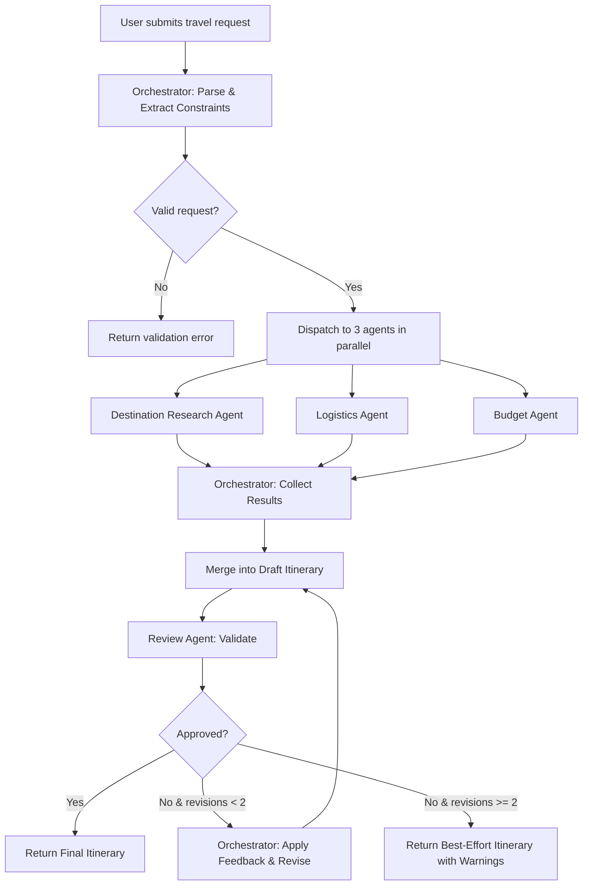

# Architecture — AI Travel Planner (Dubai)

> Multi-Agent System that converts a natural-language travel request into a complete, budget-aware, day-by-day Dubai itinerary.

---

## Table of Contents

1. [System Overview](#1-system-overview)
2. [Technology Stack](#2-technology-stack)
3. [Project Structure](#3-project-structure)
4. [Core Data Models](#4-core-data-models)
5. [Agent Architecture](#5-agent-architecture)
6. [Agent Communication Protocol](#6-agent-communication-protocol)
7. [Orchestration Flow](#7-orchestration-flow)
8. [API Layer](#8-api-layer)
9. [Configuration & Environment](#9-configuration--environment)
10. [Error Handling & Resilience](#10-error-handling--resilience)
11. [Testing Strategy](#11-testing-strategy)
12. [Phased Delivery Plan](#12-phased-delivery-plan)

---

## 1. System Overview

```
┌─────────────────────────────────────────────────────────────────┐
│                         USER REQUEST                            │
│  "Plan a 5-day trip to Dubai. $3,000 budget. Love food,        │
│   architecture, and desert experiences, hate crowds."           │
└──────────────────────────┬──────────────────────────────────────┘
                           │
                           ▼
                ┌─────────────────────┐
                │  Orchestrator Agent  │
                │  (Master Controller) │
                └─────────┬───────────┘
                          │
            ┌─────────────┼─────────────┐
            │             │             │
            ▼             ▼             ▼
   ┌────────────┐ ┌──────────────┐ ┌──────────┐
   │ Destination │ │  Logistics   │ │  Budget  │
   │  Research   │ │    Agent     │ │  Agent   │
   │   Agent     │ │              │ │          │
   └──────┬─────┘ └──────┬───────┘ └────┬─────┘
          │              │              │
          └──────────────┼──────────────┘
                         │
                         ▼
                ┌─────────────────┐
                │  Review Agent    │
                │  (QA Validator)  │
                └────────┬────────┘
                         │
                         ▼
              ┌─────────────────────┐
              │  FINAL ITINERARY    │
              └─────────────────────┘
```

The system follows a **fan-out / fan-in** pattern:

1. **Fan-out** — The Orchestrator parses the user request and dispatches sub-tasks to three specialist agents **in parallel**.
2. **Fan-in** — The Orchestrator collects all agent outputs and merges them into a draft itinerary.
3. **Review gate** — The Review Agent validates the draft against the original constraints before delivery.

---

## 2. Technology Stack

| Layer | Technology | Rationale |
|---|---|---|
| **Language** | Python 3.12+ | Rich AI/ML ecosystem, async support |
| **LLM Provider** | Google Gemini API (parallel agents) + Groq API (review) | Gemini for high-concurrency 2M-token context; Groq (LLaMA) for strong QA reasoning |
| **Agent Framework** | LangGraph / LangChain | Built-in agent orchestration, tool-calling, state management |
| **Web Framework** | FastAPI | Async-native, auto-generated OpenAPI docs |
| **Data Validation** | Pydantic v2 | Typed schemas, serialization, LLM structured output |
| **Async Runtime** | `asyncio` + `httpx` | Non-blocking parallel agent execution |
| **Config Management** | `python-dotenv` + `pydantic-settings` | Secure env-based configuration |
| **Testing** | `pytest` + `pytest-asyncio` | Async test support, fixtures |
| **Logging** | `structlog` | Structured JSON logging for agent traces |
| **Package Manager** | `uv` | Fast dependency resolution |

---

## 3. Project Structure

```
Travel Planner/
├── Docs/
│   ├── problemStatement.md        # Problem statement (Dubai-focused)
│   ├── architecture.md            # This document
│   └── problemstatement.txt       # Original raw problem statement
│
├── src/
│   ├── main.py                    # FastAPI app entry point
│   ├── config.py                  # Settings & environment config
│   │
│   ├── models/
│   │   ├── __init__.py
│   │   ├── request.py             # TravelRequest schema
│   │   ├── itinerary.py           # Itinerary, DayPlan, Activity schemas
│   │   ├── agent_io.py            # AgentTask, AgentResult schemas
│   │   └── budget.py              # BudgetBreakdown schema
│   │
│   ├── agents/
│   │   ├── __init__.py
│   │   ├── base.py                # BaseAgent abstract class
│   │   ├── orchestrator.py        # Orchestrator Agent
│   │   ├── destination.py         # Destination Research Agent
│   │   ├── logistics.py           # Logistics Agent
│   │   ├── budget.py              # Budget Agent
│   │   └── review.py              # Review Agent
│   │
│   ├── tools/
│   │   ├── __init__.py
│   │   ├── search.py              # Web search / knowledge retrieval
│   │   ├── currency.py            # USD ↔ AED conversion
│   │   ├── distance.py            # Travel time estimation
│   │   └── pricing.py             # Dubai attraction & hotel pricing
│   │
│   ├── prompts/
│   │   ├── orchestrator.md        # System prompt for Orchestrator
│   │   ├── destination.md         # System prompt for Destination Agent
│   │   ├── logistics.md           # System prompt for Logistics Agent
│   │   ├── budget.md              # System prompt for Budget Agent
│   │   └── review.md              # System prompt for Review Agent
│   │
│   ├── data/
│   │   ├── dubai_areas.json       # Dubai neighborhoods & landmarks
│   │   ├── dubai_hotels.json      # Sample hotel data by area
│   │   ├── dubai_attractions.json # Attractions with pricing & crowd data
│   │   ├── dubai_restaurants.json # Food districts & restaurant data
│   │   └── dubai_transport.json   # Metro routes, taxi fares, travel times
│   │
│   └── utils/
│       ├── __init__.py
│       ├── logger.py              # Structured logging setup
│       └── llm.py                 # LLM client wrapper (Gemini + Groq)
│
├── tests/
│   ├── __init__.py
│   ├── test_orchestrator.py
│   ├── test_destination.py
│   ├── test_logistics.py
│   ├── test_budget.py
│   ├── test_review.py
│   └── fixtures/
│       └── sample_requests.json   # Test travel requests
│
├── .env.example                   # Environment variable template
├── pyproject.toml                 # Project metadata & dependencies
└── README.md                      # Quick-start guide
```

---

## 4. Core Data Models

### 4.1 Travel Request (Input)

```python
class TravelRequest(BaseModel):
    """Parsed representation of the user's natural-language request."""
    raw_query: str                          # Original user input
    destination: str = "Dubai"              # Locked to Dubai for v1
    duration_days: int                      # e.g., 5
    budget_usd: float                       # e.g., 3000.0
    areas: list[str]                        # e.g., ["Downtown", "Marina", "Old Dubai"]
    preferences: list[str]                  # e.g., ["food", "architecture", "desert"]
    avoidances: list[str]                   # e.g., ["crowds"]
    travelers: int = 1                      # Number of travelers
    travel_dates: Optional[DateRange] = None
```

### 4.2 Itinerary (Output)

```python
class Activity(BaseModel):
    name: str                               # e.g., "Burj Khalifa At The Top"
    area: str                               # e.g., "Downtown"
    category: str                           # "food" | "architecture" | "desert" | "culture" | "shopping"
    time_slot: str                          # "morning" | "afternoon" | "evening"
    duration_hours: float                   # e.g., 2.0
    estimated_cost_usd: float              # e.g., 40.0
    crowd_level: str                        # "low" | "medium" | "high"
    description: str
    tips: Optional[str] = None

class DayPlan(BaseModel):
    day_number: int                         # 1-indexed
    date: Optional[date] = None
    theme: str                              # e.g., "Old Dubai Heritage & Souks"
    base_area: str                          # Where the traveler sleeps that night
    activities: list[Activity]
    transport_notes: str                    # How to move between activities
    meals: list[Activity]                   # Restaurants / food experiences
    estimated_day_cost_usd: float

class Itinerary(BaseModel):
    request: TravelRequest
    days: list[DayPlan]
    accommodation: AccommodationPlan
    budget_breakdown: BudgetBreakdown
    review_result: ReviewResult
    generated_at: datetime
```

### 4.3 Budget Breakdown

```python
class BudgetBreakdown(BaseModel):
    total_budget_usd: float
    estimated_total_usd: float
    remaining_usd: float
    within_budget: bool
    categories: dict[str, float]            # {"stay": 900, "transport": 300, ...}
    warnings: list[str]                     # e.g., ["Hotel cost exceeds 40% of budget"]
    suggestions: list[str]                  # e.g., ["Consider Deira instead of Downtown"]
```

### 4.4 Agent Communication

```python
class AgentTask(BaseModel):
    """A task dispatched by the Orchestrator to a specialist agent."""
    task_id: str                            # UUID
    agent_type: AgentType                   # DESTINATION | LOGISTICS | BUDGET | REVIEW
    request: TravelRequest                  # The parsed travel request
    context: dict = {}                      # Additional context from other agents
    created_at: datetime

class AgentResult(BaseModel):
    """The output returned by a specialist agent."""
    task_id: str
    agent_type: AgentType
    status: ResultStatus                    # SUCCESS | PARTIAL | FAILED
    payload: dict                           # Agent-specific structured output
    confidence: float                       # 0.0–1.0 confidence score
    reasoning: str                          # Brief explanation of decisions
    errors: list[str] = []
    duration_ms: int

class ReviewResult(BaseModel):
    """Quality check output from the Review Agent."""
    approved: bool
    score: float                            # 0.0–1.0 overall quality
    checks: dict[str, CheckResult]          # Per-criterion pass/fail
    feedback: list[str]                     # Actionable improvement suggestions
    revision_needed: bool
```

---

## 5. Agent Architecture

### 5.1 Base Agent Contract

Every agent implements the same interface:

```python
class BaseAgent(ABC):
    """Abstract base for all agents in the system."""

    def __init__(self, llm_client: LLMClient, config: AgentConfig):
        self.llm = llm_client
        self.config = config
        self.logger = get_logger(self.__class__.__name__)

    @abstractmethod
    async def execute(self, task: AgentTask) -> AgentResult:
        """Process the assigned task and return structured output."""
        ...

    def _load_prompt(self) -> str:
        """Load the agent's system prompt from the prompts/ directory."""
        ...

    def _build_tools(self) -> list[Tool]:
        """Return the set of tools this agent can use."""
        ...
```

### 5.2 Agent Specifications

| Agent | Inputs | Tools | Output |
|---|---|---|---|
| **Orchestrator** | Raw user query | NLP parsing (LLM) | `TravelRequest` + dispatches `AgentTask`s |
| **Destination Research** | `TravelRequest` | `search`, Dubai static data | Recommended activities, landmarks, food spots |
| **Logistics** | `TravelRequest` | `distance`, `dubai_transport.json`, `dubai_hotels.json` | `AccommodationPlan`, transport plan, daily sequences |
| **Budget** | `TravelRequest` + outputs from Destination & Logistics | `currency`, `pricing` | `BudgetBreakdown`, cost warnings, alternatives |
| **Review** | Draft `Itinerary` + original `TravelRequest` | Validation logic (LLM + rule-based) | `ReviewResult` with pass/fail per criterion |

### 5.3 Agent Prompt Design

Each agent's system prompt lives in `src/prompts/` as a Markdown file and follows this structure:

```markdown
# Role
You are the [Agent Name] for an AI Travel Planner focused on Dubai, UAE.

# Objective
[Specific goal of this agent]

# Constraints
- Dubai only (v1)
- Budget must be in USD, convert to AED where needed
- Prioritize user preferences, respect avoidances

# Output Format
Return a JSON object matching the following schema:
[Pydantic model JSON schema]

# Examples
[Few-shot examples of input → output]
```

---

## 6. Agent Communication Protocol

### 6.1 Message Flow

Agents communicate through the Orchestrator using **structured message passing** — no direct agent-to-agent communication.

```
                    ┌──────────────┐
                    │ Orchestrator │
                    └──────┬───────┘
                           │
              ┌────────────┼────────────┐
              │            │            │
         AgentTask    AgentTask    AgentTask
              │            │            │
              ▼            ▼            ▼
         ┌─────────┐ ┌──────────┐ ┌────────┐
         │  Dest.   │ │ Logist.  │ │ Budget │
         └────┬────┘ └────┬─────┘ └───┬────┘
              │           │           │
         AgentResult  AgentResult  AgentResult
              │           │           │
              └───────────┼───────────┘
                          │
                          ▼
                   ┌──────────────┐
                   │ Orchestrator │ ── merges into draft Itinerary
                   └──────┬───────┘
                          │
                     AgentTask
                          │
                          ▼
                   ┌──────────────┐
                   │ Review Agent │
                   └──────┬───────┘
                          │
                     ReviewResult
                          │
                          ▼
                  ┌────────────────┐
                  │ Final Itinerary│
                  └────────────────┘
```

### 6.2 State Management

The Orchestrator maintains a **PlanningState** object that accumulates data as agents complete their work:

```python
class PlanningState(BaseModel):
    """Mutable state passed through the orchestration graph."""
    request: TravelRequest
    destination_result: Optional[AgentResult] = None
    logistics_result: Optional[AgentResult] = None
    budget_result: Optional[AgentResult] = None
    draft_itinerary: Optional[Itinerary] = None
    review_result: Optional[ReviewResult] = None
    revision_count: int = 0
    status: PlanningStatus = PlanningStatus.PARSING
```

### 6.3 LangGraph Integration

The orchestration flow is modeled as a **LangGraph StateGraph**:

```python
from langgraph.graph import StateGraph, END

graph = StateGraph(PlanningState)

# Nodes
graph.add_node("parse_request",    parse_request_node)
graph.add_node("research",        destination_agent_node)
graph.add_node("logistics",       logistics_agent_node)
graph.add_node("budget",          budget_agent_node)
graph.add_node("merge_itinerary", merge_itinerary_node)
graph.add_node("review",          review_agent_node)

# Edges
graph.set_entry_point("parse_request")
graph.add_edge("parse_request", "research")
graph.add_edge("parse_request", "logistics")
graph.add_edge("parse_request", "budget")
graph.add_edge(["research", "logistics", "budget"], "merge_itinerary")
graph.add_edge("merge_itinerary", "review")
graph.add_conditional_edges("review", should_revise, {
    True:  "merge_itinerary",   # Loop back for revision
    False: END                  # Deliver final itinerary
})
```

---

## 7. Orchestration Flow

### 7.1 Step-by-Step Execution



### 7.2 Parallel Execution

The three specialist agents run **concurrently** using `asyncio.gather`:

```python
async def fan_out(state: PlanningState) -> PlanningState:
    destination_task = destination_agent.execute(make_task(state, AgentType.DESTINATION))
    logistics_task   = logistics_agent.execute(make_task(state, AgentType.LOGISTICS))
    budget_task      = budget_agent.execute(make_task(state, AgentType.BUDGET))

    results = await asyncio.gather(
        destination_task, logistics_task, budget_task,
        return_exceptions=True
    )

    state.destination_result = results[0]
    state.logistics_result   = results[1]
    state.budget_result      = results[2]
    return state
```

### 7.3 Revision Loop

If the Review Agent flags issues, the Orchestrator can revise up to **2 times** before returning a best-effort result:

| Revision | Trigger | Action |
|---|---|---|
| 1st | Budget exceeded | Budget Agent re-suggests cheaper alternatives |
| 2nd | Schedule unrealistic | Logistics Agent re-sequences the day plan |
| Give up | Still failing after 2 | Return itinerary with warnings attached |

---

## 8. API Layer

### 8.1 Endpoints

```
POST  /api/v1/plan          →  Generate a new travel itinerary
GET   /api/v1/plan/{id}     →  Retrieve a previously generated plan
GET   /api/v1/health        →  Health check
```

### 8.2 Request / Response

**POST /api/v1/plan**

```json
// Request
{
  "query": "Plan a 5-day trip to Dubai. $3,000 budget. Love food, architecture, and desert experiences, hate crowds."
}

// Response (200 OK)
{
  "plan_id": "a1b2c3d4",
  "status": "completed",
  "itinerary": {
    "days": [
      {
        "day_number": 1,
        "theme": "Old Dubai Heritage & Souks",
        "base_area": "Deira",
        "activities": [...],
        "meals": [...],
        "transport_notes": "Metro Red Line to Al Fahidi, then walk",
        "estimated_day_cost_usd": 185.00
      }
    ],
    "budget_breakdown": {
      "total_budget_usd": 3000,
      "estimated_total_usd": 2650,
      "within_budget": true,
      "categories": {
        "stay": 900,
        "transport": 250,
        "food": 600,
        "activities": 900
      }
    },
    "review_result": {
      "approved": true,
      "score": 0.92,
      "checks": {
        "duration_match": { "passed": true },
        "budget_compliance": { "passed": true },
        "preference_coverage": { "passed": true },
        "avoidance_respected": { "passed": true },
        "logistics_feasibility": { "passed": true }
      }
    }
  },
  "generated_at": "2026-07-29T16:00:00Z"
}
```

---

## 9. Configuration & Environment

### 9.1 Environment Variables

```env
# .env.example

# LLM
GEMINI_API_KEY=your-gemini-api-key
GEMINI_MODEL=gemini-3.6-flash
GROQ_API_KEY=your-groq-api-key
GROQ_MODEL=llama-3.3-70b-versatile
LLM_TEMPERATURE=0.7
LLM_MAX_TOKENS=8192

# App
APP_ENV=development          # development | staging | production
APP_PORT=8000
LOG_LEVEL=INFO

# Agent Tuning
MAX_REVISION_LOOPS=2
AGENT_TIMEOUT_SECONDS=30
PARALLEL_AGENT_EXECUTION=true

# Dubai Data
DEFAULT_CURRENCY=USD
TARGET_CURRENCY=AED
EXCHANGE_RATE_USD_AED=3.67
```

### 9.2 Settings Model

```python
class Settings(BaseSettings):
    gemini_api_key: SecretStr
    gemini_model: str = "gemini-3.6-flash"
    groq_api_key: SecretStr
    groq_model: str = "llama-3.3-70b-versatile"
    llm_temperature: float = 0.7
    max_revision_loops: int = 2
    agent_timeout_seconds: int = 30
    parallel_agent_execution: bool = True
    exchange_rate_usd_aed: float = 3.67

    model_config = SettingsConfigDict(env_file=".env")
```

---

## 10. Error Handling & Resilience

### 10.1 Failure Modes

| Failure | Impact | Mitigation |
|---|---|---|
| LLM API timeout | Agent cannot complete | Retry with exponential backoff (3 attempts, 2s/4s/8s) |
| LLM returns malformed JSON | Pydantic validation fails | Re-prompt with error feedback; fallback to raw text parsing |
| Single agent fails | Incomplete itinerary | Orchestrator proceeds with partial data + warning flag |
| All agents fail | No itinerary possible | Return error with helpful message |
| Review loop exceeds max | Infinite loop risk | Hard cap at `MAX_REVISION_LOOPS` (default: 2) |
| Rate limiting | 429 from LLM provider | Backoff + queue; respect `Retry-After` header |

### 10.2 Retry Strategy

```python
@retry(
    stop=stop_after_attempt(3),
    wait=wait_exponential(multiplier=2, min=2, max=8),
    retry=retry_if_exception_type((httpx.TimeoutException, httpx.HTTPStatusError))
)
async def call_llm(self, prompt: str) -> str:
    ...
```

### 10.3 Graceful Degradation

If one specialist agent fails while others succeed:

- The Orchestrator builds the itinerary from available data
- Missing sections are marked with `"status": "partial"`
- The Review Agent flags incomplete areas
- The user receives the best-effort plan with transparency about what's missing

---

## 11. Testing Strategy

### 11.1 Test Layers

| Layer | What | How |
|---|---|---|
| **Unit** | Individual agent logic, data parsing, tool functions | `pytest` with mocked LLM responses |
| **Integration** | Full orchestration flow with real LLM calls | `pytest` with live API (gated behind `--live` flag) |
| **Contract** | Agent input/output schema validation | Pydantic model tests with edge cases |
| **Snapshot** | Itinerary output stability | Compare against golden outputs |

### 11.2 Mocking Strategy

```python
# Mock LLM responses for deterministic testing
@pytest.fixture
def mock_destination_response():
    return AgentResult(
        task_id="test-001",
        agent_type=AgentType.DESTINATION,
        status=ResultStatus.SUCCESS,
        payload={
            "activities": [
                {"name": "Al Fahidi Historical District", "area": "Old Dubai", ...},
                {"name": "Dubai Frame", "area": "Zabeel", ...}
            ]
        },
        confidence=0.9,
        reasoning="Selected low-crowd heritage sites matching user preferences."
    )
```

---

## 12. Phased Delivery Plan

### Phase 1 — Foundation (Week 1)

- [ ] Project scaffolding (`pyproject.toml`, directory structure)
- [ ] Pydantic data models (`TravelRequest`, `Itinerary`, `AgentTask`, `AgentResult`)
- [ ] LLM client wrapper (Gemini API integration)
- [ ] Static Dubai data files (areas, hotels, attractions, transport)
- [ ] BaseAgent abstract class

### Phase 2 — Agent Implementation (Week 2)

- [ ] Orchestrator Agent (request parsing + dispatch + merge)
- [ ] Destination Research Agent (activity recommendations)
- [ ] Logistics Agent (accommodation + transport + day sequencing)
- [ ] Budget Agent (cost breakdown + warnings + alternatives)
- [ ] Agent prompt files in `src/prompts/`

### Phase 3 — Orchestration & Review (Week 3)

- [ ] LangGraph state graph wiring
- [ ] Parallel agent execution with `asyncio.gather`
- [ ] Review Agent (validation checks)
- [ ] Revision loop (up to 2 iterations)
- [ ] End-to-end integration testing

### Phase 4 — API & Polish (Week 4)

- [ ] FastAPI endpoints (`/plan`, `/plan/{id}`, `/health`)
- [ ] Structured logging with `structlog`
- [ ] Error handling & retry logic
- [ ] README with quick-start instructions
- [ ] Demo with sample Dubai travel requests

---

## Key Design Decisions

| Decision | Choice | Reasoning |
|---|---|---|
| **Dubai-only (v1)** | Hardcoded destination | Focused scope; allows curated static data for high-quality output |
| **Fan-out parallel execution** | 3 agents run concurrently | Reduces latency by ~60% vs sequential |
| **LangGraph for orchestration** | StateGraph with conditional edges | Clean revision loops, visual debugging, native async |
| **Static data + LLM hybrid** | JSON data files + LLM reasoning | Reliable pricing/distances from data; creative planning from LLM |
| **Max 2 revision loops** | Hard cap on Review → Revise | Prevents infinite loops while allowing quality improvement |
| **Pydantic everywhere** | All agent I/O is typed | Catches schema mismatches early; enables LLM structured output |
