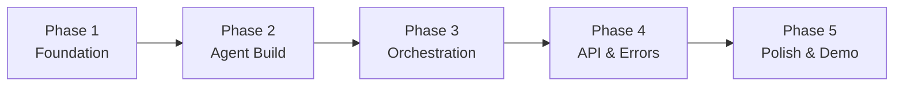

# Implementation Plan — AI Travel Planner (Dubai)

> Phase-wise execution roadmap for building the multi-agent travel planning system.
> Derived from [problemStatement.md](file:///c:/Users/jangr/Documents/Travel%20Planner/Docs/problemStatement.md) and [architecture.md](file:///c:/Users/jangr/Documents/Travel%20Planner/Docs/architecture.md).

---

## Overview

| Attribute | Value |
|---|---|
| **Total Phases** | 5 |
| **Estimated Duration** | 5 weeks |
| **Destination Scope** | Dubai, UAE only (v1) |
| **Core Stack** | Python 3.12+, Gemini API (primary LLM) + Groq API (Review Agent), LangGraph, FastAPI, Pydantic v2 |
| **Delivery Model** | Each phase produces a runnable, testable increment |

```
Phase 1          Phase 2           Phase 3             Phase 4          Phase 5
Foundation  →  Agent Build  →  Orchestration  →  API & Integration  →  Polish & Demo
(Week 1)       (Week 2)        (Week 3)           (Week 4)            (Week 5)
```

---

## Phase 1 — Foundation & Project Setup

**Goal:** Establish the project skeleton, data models, dual-LLM integration (Gemini + Groq), and Dubai knowledge base scraped from Wikivoyage so agents can be built on a solid foundation.

**Duration:** Week 1

---

### 1.1 Project Scaffolding

| Task | File(s) | Details |
|---|---|---|
| Initialize Python project | `pyproject.toml` | Use `uv init`; define project metadata, Python ≥ 3.12 |
| Declare dependencies | `pyproject.toml` | `langchain`, `langgraph`, `groq`, `google-genai`, `fastapi`, `uvicorn`, `pydantic`, `pydantic-settings`, `httpx`, `beautifulsoup4`, `structlog`, `python-dotenv`, `tenacity`, `pytest`, `pytest-asyncio` |
| Create directory structure | `src/`, `tests/`, `Docs/` | Match the layout defined in [architecture.md § 3](file:///c:/Users/jangr/Documents/Travel%20Planner/Docs/architecture.md) |
| Create env template | `.env.example` | `GROQ_API_KEY`, `GROQ_MODEL`, `GEMINI_API_KEY`, `GEMINI_MODEL`, `LLM_TEMPERATURE`, `APP_PORT`, `MAX_REVISION_LOOPS`, etc. |
| Add `.gitignore` | `.gitignore` | Python defaults + `.env`, `__pycache__`, `.venv/` |
| Create `README.md` | `README.md` | Project title, description, quick-start placeholder |

**Files created:**
```
Travel Planner/
├── pyproject.toml
├── .env.example
├── .gitignore
├── README.md
└── src/
    ├── __init__.py
    ├── main.py              # Empty FastAPI stub
    ├── config.py
    ├── models/
    │   └── __init__.py
    ├── agents/
    │   └── __init__.py
    ├── tools/
    │   └── __init__.py
    ├── prompts/
    ├── data/
    └── utils/
        └── __init__.py
```

---

### 1.2 Configuration & Settings

| Task | File | Details |
|---|---|---|
| Implement Settings model | `src/config.py` | Pydantic `BaseSettings` with `SettingsConfigDict(env_file=".env")` |
| Validate on startup | `src/config.py` | Fail fast if `GROQ_API_KEY` or `GEMINI_API_KEY` is missing |

**Key settings:**

```python
class Settings(BaseSettings):
    # Gemini — used by Orchestrator, Destination, Logistics, Budget agents
    gemini_api_key: SecretStr
    gemini_model: str = "gemini-3.6-flash"   # Large context, fast parallel execution

    # Groq — used exclusively by the Review Agent
    groq_api_key: SecretStr
    groq_model: str = "llama-3.3-70b-versatile" # High-quality reasoning for QA

    llm_temperature: float = 0.7
    llm_max_tokens: int = 8192
    max_revision_loops: int = 2
    agent_timeout_seconds: int = 30
    parallel_agent_execution: bool = True
    exchange_rate_usd_aed: float = 3.67
    app_port: int = 8000
    log_level: str = "INFO"
```

> [!IMPORTANT]
> **Dual-LLM rationale:** Gemini 3.6 Flash provides massive concurrency limits and a 2M token context window, making it ideal for the 4 parallel agents that need to process large amounts of scraped Wikivoyage data without hitting rate limits. Groq (LLaMA 3.3 70B) is used for the Review Agent because its powerful reasoning capabilities make it an excellent independent QA validator for the final itinerary, and a single review call easily fits within its strict rate limits.

---

### 1.3 Core Data Models

| Task | File | Details |
|---|---|---|
| `TravelRequest` model | `src/models/request.py` | Parsed user input — destination (locked to "Dubai"), duration, budget, areas, preferences, avoidances |
| `Itinerary` model | `src/models/itinerary.py` | `Itinerary` → `DayPlan` → `Activity`; includes `AccommodationPlan` |
| `BudgetBreakdown` model | `src/models/budget.py` | Category-wise spend, warnings, suggestions, `within_budget` flag |
| `AgentTask` / `AgentResult` | `src/models/agent_io.py` | `AgentType` enum, `ResultStatus` enum, `ReviewResult`, `CheckResult` |
| `PlanningState` model | `src/models/agent_io.py` | Mutable state object for the LangGraph orchestration loop |

**Schemas to implement (see [architecture.md § 4](file:///c:/Users/jangr/Documents/Travel%20Planner/Docs/architecture.md)):**

- `TravelRequest` — raw_query, destination, duration_days, budget_usd, areas, preferences, avoidances, travelers
- `Activity` — name, area, category, time_slot, duration_hours, estimated_cost_usd, crowd_level, description, tips
- `DayPlan` — day_number, theme, base_area, activities, transport_notes, meals, estimated_day_cost_usd
- `Itinerary` — request, days, accommodation, budget_breakdown, review_result, generated_at
- `BudgetBreakdown` — total_budget_usd, estimated_total_usd, remaining_usd, within_budget, categories, warnings, suggestions
- `AgentTask` — task_id, agent_type, request, context, created_at
- `AgentResult` — task_id, agent_type, status, payload, confidence, reasoning, errors, duration_ms
- `ReviewResult` — approved, score, checks, feedback, revision_needed
- `PlanningState` — request, *_result fields, draft_itinerary, revision_count, status

---

### 1.4 LLM Client Wrapper (Dual-Provider)

| Task | File | Details |
|---|---|---|
| Create `LLMClient` interface | `src/utils/llm.py` | Abstract base with `async call(system_prompt, user_prompt, response_model) → T` |
| Implement `GroqClient` | `src/utils/llm.py` | Async wrapper around the `groq` SDK; used exclusively by the Review Agent |
| Implement `GeminiClient` | `src/utils/llm.py` | Async wrapper around `google-genai`; used by Orchestrator, Destination, Logistics, Budget agents |
| Add retry logic | `src/utils/llm.py` | `tenacity` decorator on both clients: 3 attempts, exponential backoff (2s → 4s → 8s) |
| Add structured output | `src/utils/llm.py` | Groq: JSON mode with function-calling; Gemini: JSON mode + Pydantic schema |
| Factory function | `src/utils/llm.py` | `get_llm_client(provider: "groq" \| "gemini") → LLMClient` — returns the appropriate client based on agent type |
| Test LLM connectivity | `tests/test_llm_client.py` | Smoke tests for both Groq and Gemini clients; verify response structure |

**Client selection per agent:**

| Agent | LLM Provider | Model | Rationale |
|---|---|---|---|
| Orchestrator | **Gemini** | `gemini-3.6-flash` | Generous rate limits for parallel execution |
| Destination Research | **Gemini** | `gemini-3.6-flash` | Huge context window for Wikivoyage data |
| Logistics | **Gemini** | `gemini-3.6-flash` | Huge context window for Wikivoyage data |
| Budget | **Gemini** | `gemini-3.6-flash` | Huge context window for Wikivoyage data |
| Review | **Groq** | `llama-3.3-70b-versatile` | Stronger independent reasoning for QA validation |

---

### 1.5 Dubai Knowledge Base — Wikivoyage Scraper

> [!IMPORTANT]
> Instead of hand-crafted mock JSON files, the system scrapes real travel data from the **[Wikivoyage Dubai page](https://en.wikivoyage.org/wiki/Dubai)**. This provides authentic, community-maintained information about districts, attractions, restaurants, hotels, transport, and budget guidance.

| Task | File | Details |
|---|---|---|
| Build Wikivoyage scraper | `src/tools/scraper.py` | Fetch and parse `https://en.wikivoyage.org/wiki/Dubai` using `httpx` + `BeautifulSoup4` |
| Parse Districts section | `src/tools/scraper.py` | Extract Dubai districts/areas: Deira, Bur Dubai, Sheikh Zayed Road, Downtown, Jumeirah, Marina, etc. |
| Parse See / Do sections | `src/tools/scraper.py` | Extract attractions with descriptions, addresses, and any listed prices |
| Parse Eat section | `src/tools/scraper.py` | Extract restaurants/food listings grouped by Budget / Mid-range / Splurge tiers |
| Parse Sleep section | `src/tools/scraper.py` | Extract accommodation listings grouped by Budget / Mid-range / Splurge tiers |
| Parse Get around section | `src/tools/scraper.py` | Extract transport modes: Metro (Red/Green lines), taxis, buses, abras (water taxis), monorail, fares |
| Parse Buy section | `src/tools/scraper.py` | Extract shopping areas and souks |
| Normalize to JSON schemas | `src/tools/scraper.py` | Convert scraped data into structured Pydantic models matching `Activity`, `Hotel`, `Transport` schemas |
| Cache scraped data | `src/data/dubai_wikivoyage.json` | Save scraped + normalized data to JSON; re-scrape only on demand or if cache is stale (>7 days) |
| Unit tests for scraper | `tests/test_scraper.py` | Verify parsing against a saved HTML snapshot; ensure all sections extract correctly |

**Wikivoyage sections mapped to agent data needs:**

| Wikivoyage Section | Data Extracted | Used By Agent |
|---|---|---|
| **Districts** | Area names, descriptions, character | Destination, Logistics |
| **See** | Landmarks, museums, mosques, architectural sites | Destination |
| **Do** | Activities, desert safaris, water sports, tours | Destination |
| **Eat** (Budget / Mid-range / Splurge) | Restaurant names, cuisine, price tier, area | Destination, Budget |
| **Sleep** (Budget / Mid-range / Splurge) | Hotel names, price range, area, star category | Logistics, Budget |
| **Get around** | Metro lines, taxi fares, abra routes, bus info | Logistics |
| **Buy** | Souks, malls, shopping areas | Destination |
| **Budget** section | Typical daily costs, tipping norms, cost-saving tips | Budget |

**Scraper output format:**

```json
{
  "source": "https://en.wikivoyage.org/wiki/Dubai",
  "scraped_at": "2026-07-29T16:00:00Z",
  "districts": [
    {"name": "Deira", "description": "The older, more traditional part of Dubai..."},
    {"name": "Downtown Dubai", "description": "Home to the Burj Khalifa and Dubai Mall..."}
  ],
  "attractions": [
    {"name": "Burj Khalifa", "area": "Downtown", "category": "architecture", "description": "...", "price_info": "Dh149-399"}
  ],
  "restaurants": {
    "budget": [{"name": "...", "cuisine": "...", "area": "...", "price_tier": "budget"}],
    "mid_range": [...],
    "splurge": [...]
  },
  "hotels": {
    "budget": [...],
    "mid_range": [...],
    "splurge": [...]
  },
  "transport": {
    "metro": {"lines": [...], "fare_info": "..."},
    "taxi": {"base_fare": "...", "per_km": "..."},
    "abra": {"fare": "1 Dh", "routes": [...]},
    "bus": {"fare_info": "..."}
  }
}
```

---

### 1.6 Logger Setup

| Task | File | Details |
|---|---|---|
| Configure `structlog` | `src/utils/logger.py` | JSON output in production, colored console in development; bind agent_name, task_id to log context |
| Create `get_logger()` helper | `src/utils/logger.py` | Returns a bound logger with the caller's class name |

---

### Phase 1 — Acceptance Criteria

- [ ] `uv sync` installs all dependencies without error
- [ ] `python -c "from src.config import Settings"` loads settings from `.env`
- [ ] All Pydantic models instantiate with valid sample data
- [ ] Groq client successfully calls Groq API and returns a response
- [ ] Gemini client successfully calls Gemini API and returns a response
- [ ] Wikivoyage scraper fetches and parses the Dubai page into valid JSON
- [ ] Cached `dubai_wikivoyage.json` contains districts, attractions, restaurants, hotels, transport
- [ ] `pytest tests/` passes (model + config + LLM smoke + scraper tests)

---

## Phase 2 — Agent Implementation

**Goal:** Build all 5 agents as standalone, testable units with their system prompts and tool integrations.

**Duration:** Week 2

**Depends on:** Phase 1 (data models, LLM client, static data)

---

### 2.1 Base Agent

| Task | File | Details |
|---|---|---|
| Define `BaseAgent` ABC | `src/agents/base.py` | `__init__(llm_client, config)`, abstract `execute(task) → AgentResult`, `_load_prompt()`, `_build_tools()` |
| Accept `LLMClient` interface | `src/agents/base.py` | Constructor accepts either `GroqClient` or `GeminiClient` — agents are LLM-agnostic at the base level |
| Implement prompt loading | `src/agents/base.py` | Read from `src/prompts/{agent_name}.md` at init time |
| Add timing decorator | `src/agents/base.py` | Measure `duration_ms` for each `execute()` call |

---

### 2.2 Orchestrator Agent

| Task | File | Details |
|---|---|---|
| Implement `OrchestratorAgent` | `src/agents/orchestrator.py` | Extends `BaseAgent`; uses **Gemini** LLM to parse raw query → `TravelRequest` |
| Write system prompt | `src/prompts/orchestrator.md` | Role definition, constraint extraction rules, output JSON schema |
| Request parsing logic | `src/agents/orchestrator.py` | Extract: destination (always "Dubai"), duration, budget, areas, preferences, avoidances |
| Task dispatch logic | `src/agents/orchestrator.py` | Create `AgentTask` for each specialist agent |
| Result merging logic | `src/agents/orchestrator.py` | Combine 3 agent results into a draft `Itinerary` |
| Unit tests | `tests/test_orchestrator.py` | Mock LLM; verify extraction from 3+ sample queries |

**Test cases for parsing:**

| Input Query | Expected Extraction |
|---|---|
| "5 days in Dubai, $3000, love food and architecture" | duration=5, budget=3000, preferences=["food","architecture"] |
| "3-day Dubai trip for 2 people, budget $5000, avoid tourist traps" | duration=3, budget=5000, travelers=2, avoidances=["tourist traps"] |
| "Weekend getaway Dubai, unlimited budget, love luxury and spas" | duration=2, budget=null/unlimited, preferences=["luxury","spas"] |

---

### 2.3 Destination Research Agent

| Task | File | Details |
|---|---|---|
| Implement `DestinationAgent` | `src/agents/destination.py` | Extends `BaseAgent`; uses **Gemini** LLM + Wikivoyage data to recommend activities |
| Write system prompt | `src/prompts/destination.md` | Dubai expert persona, preference matching, crowd avoidance rules |
| Integrate Wikivoyage data | `src/tools/repository.py` | Load and index attractions, restaurants, and districts from `dubai_wikivoyage.json` (scraped from Wikivoyage) |
| Implement search tool | `src/tools/search.py` | Expose read-only `find_attractions`, `find_restaurants`, `find_districts` using `repository.py` |
| Implement preference matching | `src/agents/destination.py` | Use `search.py` to filter activities by user preferences; deprioritize high-crowd items when avoidance is set |
| Unit tests | `tests/test_destination.py` | Verify: food preference → food activities ranked high; "avoid crowds" → high-crowd items filtered |

**Agent output structure:**

```python
{
    "recommended_activities": [...],     # Sorted by relevance
    "must_do": [...],                    # Top 5 can't-miss items
    "nice_to_have": [...],              # Optional if time permits
    "food_recommendations": [...],       # Restaurants & food experiences
    "area_suggestions": [...]            # Best neighborhoods to explore
}
```

---

### 2.4 Logistics Agent

| Task | File | Details |
|---|---|---|
| Implement `LogisticsAgent` | `src/agents/logistics.py` | Extends `BaseAgent`; uses **Gemini** LLM + Wikivoyage data to build accommodation plan + daily movement sequences |
| Write system prompt | `src/prompts/logistics.md` | Practical planner persona, minimize backtracking, realistic timing |
| Build distance/time tool | `src/tools/distance.py` | District travel-time and feasibility tool; never fabricate precise minutes |
| Build pricing tool | `src/tools/pricing.py` | Lookup verified accommodation options by area, budget tier, star rating |
| Day sequencing logic | `src/agents/logistics.py` | Group activities by area per day; minimize transit; respect opening hours |
| Unit tests | `tests/test_logistics.py` | Verify: 5-day plans have 5 DayPlans; no >45-min transit between consecutive activities |

**Agent output structure:**

```python
{
    "accommodation": {
        "plan": [
            {"nights": 3, "area": "Downtown", "hotel_suggestion": "..."},
            {"nights": 2, "area": "Marina", "hotel_suggestion": "..."}
        ],
        "estimated_cost_usd": 900
    },
    "daily_sequences": [
        {
            "day": 1,
            "base_area": "Downtown",
            "sequence": ["Al Fahidi → Dubai Frame → Dubai Mall"],
            "transport": "Metro Green Line + walking"
        }
    ],
    "transport_summary": {
        "primary_mode": "Dubai Metro",
        "estimated_transport_cost_usd": 250
    }
}
```

---

### 2.5 Budget Agent

| Task | File | Details |
|---|---|---|
| Implement `BudgetAgent` | `src/agents/budget.py` | Extends `BaseAgent`; uses **Gemini** LLM + Wikivoyage pricing data to calculate category-wise spend, flags overruns |
| Write system prompt | `src/prompts/budget.md` | Financial advisor persona, conservative estimates, suggest alternatives |
| Build currency tool | `src/tools/currency.py` | Deterministic USD ↔ AED conversion using configurable exchange rate (3.67) |
| Build pricing tool | `src/tools/pricing.py` | Aggregate costs from Wikivoyage Eat/Sleep/Buy/Budget sections; return `null` if missing |
| Budget allocation logic | `src/agents/budget.py` | Default split: Stay 35%, Transport 10%, Food 25%, Activities 30% — adjustable based on preferences |
| Unit tests | `tests/test_budget.py` | Verify: total ≤ budget → `within_budget=true`; over-budget → warnings + suggestions |

**Agent output structure:**

```python
{
    "budget_breakdown": {
        "total_budget_usd": 3000,
        "estimated_total_usd": 2650,
        "remaining_usd": 350,
        "within_budget": true,
        "categories": {
            "stay": 900,
            "transport": 250,
            "food": 600,
            "activities": 900
        }
    },
    "warnings": [],
    "suggestions": ["Consider street food in Deira to save ~$100 on meals"],
    "cheaper_alternatives": [
        {"original": "5-star Downtown hotel ($250/night)", "alternative": "4-star Deira hotel ($120/night)"}
    ]
}
```

---

### 2.6 Review Agent

| Task | File | Details |
|---|---|---|
| Implement `ReviewAgent` | `src/agents/review.py` | Extends `BaseAgent`; uses **Groq** LLM to validate the draft itinerary against all original constraints |
| Write system prompt | `src/prompts/review.md` | QA reviewer persona, strict validation, actionable feedback |
| Implement validation checks | `src/agents/review.py` | 6 checks (see below) — mix of rule-based and LLM-assisted |
| Scoring logic | `src/agents/review.py` | Each check contributes to overall score (0.0–1.0); `approved = score >= 0.7` |
| Unit tests | `tests/test_review.py` | Verify: valid itinerary → approved; over-budget → not approved; missing area → feedback |

**Validation checks (from [problemStatement.md](file:///c:/Users/jangr/Documents/Travel%20Planner/Docs/problemStatement.md)):**

| # | Check | Type | Pass Condition |
|---|---|---|---|
| 1 | Duration Match | Rule-based | `len(days) == request.duration_days` |
| 2 | Area Coverage | Rule-based | Key Dubai areas present in itinerary |
| 3 | Budget Compliance | Rule-based | `estimated_total_usd <= total_budget_usd` |
| 4 | Preference Alignment | Groq LLM-assisted | Activities match stated preferences |
| 5 | Avoidance Respected | Groq LLM-assisted | No high-crowd activities when "crowds" in avoidances |
| 6 | Logistics Feasibility | Groq LLM-assisted | Travel times are realistic; no impossible sequences |

---

### Phase 2 — Acceptance Criteria

- [ ] Each agent can `execute()` independently with a mock `AgentTask`
- [ ] All 5 system prompts exist in `src/prompts/` and load without error
- [ ] Each agent returns a valid `AgentResult` matching its Pydantic schema
- [ ] Tools (distance, currency, pricing) return correct values for known inputs
- [ ] `pytest tests/` passes with ≥ 90% of test cases (mocked LLM)

---

## Phase 3 — Orchestration & Integration (Revised)

This phase integrates our standalone agents from Phase 2 into a complete, end-to-end system using langgraph. Based on the detailed feedback, we will use a **Hybrid DAG** approach.

### 3.1 Proposed Architecture: Hybrid DAG

`	ext
START
  ↓
parse_request
  ↓
┌───────────────┬────────────────┐
↓               ↓                ↓
destination   logistics_base   budget_base
└───────────────┴────────────────┘
                ↓
       merge_draft_itinerary
                ↓
      enrich_and_recalculate
          ┌───────────┐
          ↓           ↓
   logistics_final  budget_final
          └─────┬─────┘
                ↓
            review
                ↓
          revise or END
`

### 3.2 State Definition

| Task | File | Details |
|---|---|---|
| Define PlanningState | src/models/state.py | TypedDict containing raw_query, parsed_request, branch results, itinerary, revision_count, status, errors, warnings |
| Define reducers | src/models/state.py | Use operator.add for errors and warnings |

### 3.3 Failure Handling Wrapper

| Task | File | Details |
|---|---|---|
| Implement node wrapper | src/graph.py | Catch timeouts/exceptions, convert to AgentResult with PARTIAL or FAILED status, rather than crashing |

### 3.4 Orchestration Graph

| Task | File | Details |
|---|---|---|
| Define State A Nodes | src/graph.py | parse, destination, logistics_base, udget_base |
| Define Merge Node | src/graph.py | Deterministic combination of activities, day slots, costs, normalizes districts |
| Define State B Nodes | src/graph.py | logistics_final (validates sequences), udget_final (recalculates costs) |
| Define Review Node | src/graph.py | Checks final enriched itinerary against constraints |
| Route Revisions | src/graph.py | Targeted conditional edges based on failure reason (e.g. 
evise_budget, 
evise_destination). Cap at 2 revisions. |

### 3.5 End-to-End Testing

| Task | File | Details |
|---|---|---|
| Parallel barrier test | 	ests/test_e2e.py | Assert merge waits for all branches, including failures |
| No dependency leakage | 	ests/test_e2e.py | Assert base agents do not receive destination_result |
| Post-merge feasibility test | 	ests/test_e2e.py | Logistics validation flags impossible transfers |
| Exact-cost test | 	ests/test_e2e.py | Merged paid activity changes budget estimate |
| Targeted revision test | 	ests/test_e2e.py | Budget failure reruns Budget/Merge only |
| Revision cap test | 	ests/test_e2e.py | Stops after 2 loops, outputs partial/warnings |
| State reducer test | 	ests/test_e2e.py | Warnings from parallel nodes accumulate |
| Graph snapshot test | 	ests/test_e2e.py | Assert expected node routing |

---

## Phase 4 — API & Error Handling

**Goal:** Expose the system via FastAPI endpoints, add production-grade error handling, structured logging, and make the system deployable.

**Duration:** Week 4

**Depends on:** Phase 3 (end-to-end flow working)

---

### 4.1 FastAPI Application

| Task | File | Details |
|---|---|---|
| App factory | `src/main.py` | `create_app()` → FastAPI instance with CORS, lifespan events (injects store and graph into app.state) |
| Settings injection | `src/config.py` | Config loaded via `Settings()`; passed to agents during graph execution |
| Health endpoint | `src/main.py` | `GET /api/v1/health` → `{"status": "healthy", "service": "dubai-ai-travel-planner", "version": "0.1.0"}` |

---

### 4.2 Plan Endpoints

| Endpoint | Method | Details |
|---|---|---|
| `/api/v1/plan` | `POST` | Accept `{"query": "..."}`, run orchestration, return `Itinerary` JSON |
| `/api/v1/plan/{plan_id}` | `GET` | Retrieve a previously generated plan by ID |

**Request/Response contract:**

```python
# Request
class PlanRequest(BaseModel):
    query: str                    # Natural language travel request

# Response
class PlanResponse(BaseModel):
    plan_id: str                  # UUID
    status: str                   # "completed" | "partial" | "failed"
    itinerary: Optional[Itinerary]
    errors: list[str] = []
    generated_at: datetime
```

---

### 4.3 Plan Storage

| Task | File | Details |
|---|---|---|
| In-memory store (v1) | `src/utils/store.py` | Simple `dict[str, PlanResponse]` for generated plans |
| Plan ID generation | `src/utils/store.py` | `uuid4().hex[:8]` short IDs |
| Retrieval endpoint | `src/main.py` | Lookup by `plan_id`; return 404 if not found |

> [!NOTE]
> v1 uses in-memory storage. A future phase can add SQLite/PostgreSQL persistence.

---

### 4.4 Error Handling Middleware

| Task | File | Details |
|---|---|---|
| Global exception handler | `src/main.py` | Catch unhandled exceptions → return structured JSON error |
| Validation error handler | `src/main.py` | Pydantic `ValidationError` → 422 with field-level details |
| LLM error handler | `src/main.py` | Groq/Gemini API errors → 503 with retry guidance |
| Request validation | `src/main.py` | Reject empty queries, queries > 1000 chars |

**Error response format:**

```json
{
  "error": {
    "code": "BUDGET_PARSE_ERROR",
    "message": "Could not extract a budget from your request. Please specify a budget in USD.",
    "details": {}
  }
}
```

---

### 4.5 Structured Logging

| Task | File | Details |
|---|---|---|
| Request/response logging | `src/main.py` | Log every API call with request ID and plan ID |
| Agent execution logging | `src/graph.py` | Log agent start/end/duration/status using `node_wrapper` |
| Orchestration tracing | `src/graph.py` | Log state transitions throughout the DAG nodes |

**Log format (JSON):**

```json
{
  "timestamp": "2026-07-29T16:00:00Z",
  "level": "info",
  "event": "agent_completed",
  "agent": "DestinationAgent",
  "task_id": "abc123",
  "duration_ms": 3450,
  "status": "SUCCESS",
  "confidence": 0.92
}
```

---

### 4.6 Retry & Resilience

| Task | File | Details |
|---|---|---|
| LLM retry decorator | `src/utils/llm.py` | `tenacity`: up to 3 attempts, exponential backoff (2s/4s/8s) — applies to Groq and Gemini clients |
| Structured output retry | `src/utils/llm.py` | Structured output parsing handled by Pydantic; fallback retries happen via tenacity |
| Agent timeout | `src/graph.py` & `src/main.py` | `asyncio.wait_for` configurable timeout per agent in `node_wrapper`, plus global request timeout in `main.py` |
| Rate limit handling | `src/utils/llm.py` | TransientLLMError catches 429/503 from LLMs → handled gracefully by global exception handler |

---

### Phase 4 — Acceptance Criteria

- [x] `uvicorn src.main:app` starts the server successfully
- [x] `POST /api/v1/plan` with a valid query returns a complete itinerary
- [x] `GET /api/v1/plan/{id}` retrieves a previously generated plan
- [x] `GET /api/v1/health` returns 200
- [x] Invalid requests return structured error JSON (not stack traces)
- [x] Logs appear in structured JSON format with agent context
- [x] LLM retry succeeds after a simulated transient failure

---

## Phase 5 — Polish, Testing & Demo

**Goal:** Harden the system with comprehensive tests, write full documentation, and create a compelling demo.

**Duration:** Week 5

**Depends on:** Phase 4 (API functional)

---

### 5.1 Comprehensive Test Suite

| Task | File | Details |
|---|---|---|
| Model edge cases | `tests/test_models.py` | Zero budget, 1-day trip, no preferences, 10+ travelers, missing fields |
| Agent unit tests (full) | `tests/test_*.py` | ≥ 5 test cases per agent covering happy path, edge cases, error handling |
| Integration tests | `tests/test_e2e.py` | Full API tests via `httpx.AsyncClient` test client |
| Contract tests | `tests/test_contracts.py` | Validate all agent outputs against their Pydantic schemas |
| Test fixtures | `tests/fixtures/sample_requests.json` | 5+ diverse Dubai travel requests for testing |

**Sample test requests:**

```json
[
  {"query": "5-day Dubai trip, $3000, food + architecture + desert, avoid crowds"},
  {"query": "3-day luxury Dubai weekend, $10000, 2 travelers, spa + shopping"},
  {"query": "7-day budget Dubai trip, $1500 for a family of 4"},
  {"query": "4-day Dubai adventure, $4000, love water sports and nightlife"},
  {"query": "2-day Dubai stopover, $500, just want to see Burj Khalifa and eat good food"}
]
```

---

### 5.2 Documentation

| Task | File | Details |
|---|---|---|
| Complete `README.md` | `README.md` | Project overview, prerequisites, setup, running, API usage, architecture link |
| API documentation | Auto-generated | FastAPI's built-in Swagger at `/docs` and ReDoc at `/redoc` |
| Agent documentation | `Docs/agents.md` | Per-agent capabilities, I/O schemas, prompt design rationale |
| Contributing guide | `CONTRIBUTING.md` | How to add a new agent, data source, or destination |

---

### 5.3 Demo Scenarios

| Scenario | Purpose |
|---|---|
| **Standard request** | "5-day Dubai, $3000, food + architecture" → full itinerary |
| **Budget-constrained** | "$1000 Dubai 5 days" → triggers budget warnings + alternatives |
| **Preference-heavy** | "Love desert, hate shopping" → desert-focused plan, no mall activities |
| **Minimal input** | "Dubai trip" → system infers defaults, asks for missing info |
| **Revision trigger** | Force over-budget → observe review loop in action |

---

### 5.4 Performance Benchmarks

| Metric | Target | How to Measure |
|---|---|---|
| End-to-end latency | < 30 seconds | Time from API request to response |
| Parallel speedup | ≥ 2x vs sequential | Compare fan-out vs sequential agent execution |
| LLM calls per request | ≤ 8 (no revisions), ≤ 12 (with revisions) | Count via structured logs |
| Review pass rate | ≥ 80% on first attempt | Track `review_result.approved` across test runs |

---

### Phase 5 — Acceptance Criteria

- [ ] `pytest tests/ -v` passes with ≥ 95% of tests
- [ ] `README.md` enables a new developer to run the project in < 5 minutes
- [ ] All 5 demo scenarios produce valid, reviewed itineraries
- [ ] API docs are accessible at `/docs` and `/redoc`
- [ ] End-to-end latency < 30 seconds for a standard request

---

## Dependency Graph



| Phase | Hard Dependencies | Can Start Early |
|---|---|---|
| Phase 1 | None | — |
| Phase 2 | Phase 1 (models, LLM client, data) | Prompt writing can start in Phase 1 |
| Phase 3 | Phase 2 (all agents) | LangGraph graph structure can be sketched in Phase 2 |
| Phase 4 | Phase 3 (E2E flow) | FastAPI shell + health endpoint can start in Phase 1 |
| Phase 5 | Phase 4 (API working) | Test fixtures + docs can be written during Phase 3–4 |

---

## Risk Register

| Risk | Likelihood | Impact | Mitigation |
|---|---|---|---|
| Gemini `gemini-3.6-flash` rate limits (1K RPM, 10K RPD, 2M TPM) | Low | Limits are highly generous and will easily support 4 parallel agents | Utilize async concurrency fully; rely on standard exponential backoff if ever hit |
| Groq `llama-3.3-70b-versatile` rate limits (30 RPM, 1K RPD, 12K TPM, 100K TPD) | Low | Delays Review Agent testing if limits hit | Since Groq is only used for a single Review Agent call per loop, 30 RPM is plenty. |
| LLM produces inconsistent itinerary quality | High | Poor user experience | Curated prompts + Wikivoyage data + Review Agent (Groq) as quality gate |
| Agent timeout cascading | Low | Failed requests | Per-agent timeout + graceful degradation |
| Wikivoyage page structure changes (HTML) | Medium | Scraper breaks | Pin to known HTML snapshot for tests; add scraper health checks; alert on parse failures |
| Dubai data becomes stale on Wikivoyage | Low | Inaccurate plans | Cache expiry (7 days); re-scrape on demand; timestamp all cached data |
| Scope creep (adding more destinations) | Medium | Delays v1 | Strict Dubai-only for v1; design for extensibility but don't implement |

---

## Success Metrics

| Metric | Definition | Target |
|---|---|---|
| **Functional completeness** | All 5 agents operational, orchestrated, reviewed | 100% |
| **Schema compliance** | Agent outputs match Pydantic schemas | 100% |
| **Review pass rate** | Itineraries approved on first or second attempt | ≥ 80% |
| **Test coverage** | Lines covered by automated tests | ≥ 85% |
| **E2E latency** | Time from request to final itinerary | < 30s |
| **Graceful degradation** | System returns partial result when 1 agent fails | Yes |
